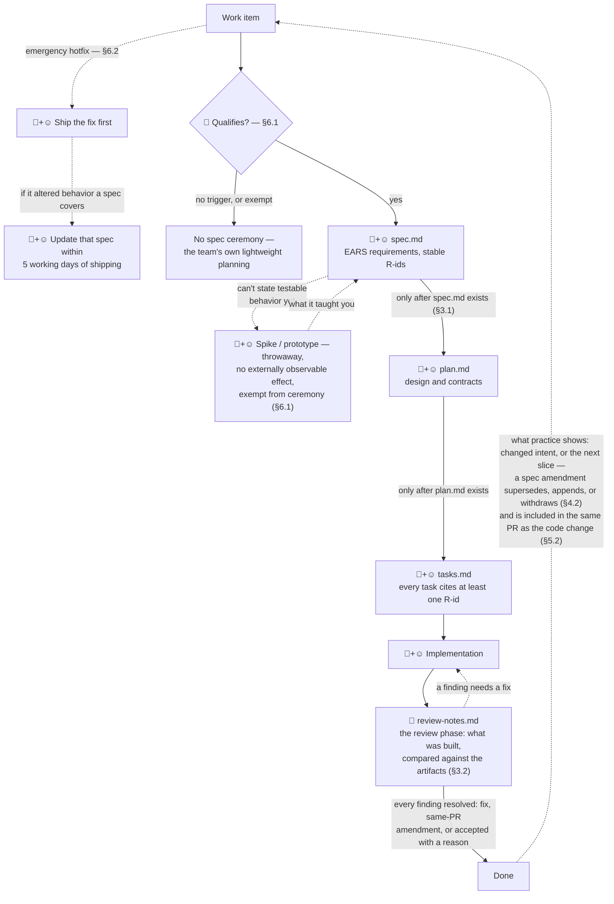

# sdd-standard

A spec-driven development (SDD) convention for an engineering
organization — versioned, reviewed, and distributed from this repository.

The convention itself is the product here. It is treated like a shared
library: semantic versioning on the convention, a changelog, code owners, and
changes by PR review. Product repos consume it via a bootstrap wrapper.
Specs always live in each product repo, next to the code they govern.
There is deliberately no central specs repository.

[GitHub Spec Kit](https://github.com/github/spec-kit) is the implementation
of the standard. The version is pinned in `speckit/PINNED-VERSION`;
upgrades are tested in this repo first.

## Why not stock Spec Kit?

Stock Spec Kit is a workflow tool: it guides an AI agent from spec through
plan and tasks to implementation. Nothing in it says how requirement ids
stay stable over time, what happens when code drifts from a spec, or
which work items need a spec at all. The convention adds those rules on
top. It uses only Spec Kit's supported preset and extension points,
never a fork, so the tool stays replaceable. What it adds
([SDD-STANDARD](standard/SDD-STANDARD.md), § references below):

- **Artifact order, enforced.** Requirements → Design → Tasks exist in
  order before implementation starts; the review phase runs after it.
  The order is structural — no `plan.md` without `spec.md`, no
  `tasks.md` without `plan.md` — and CI checks presence (§3). There are
  no human approval gates (§3.3, D-19).
- **Requirements that never change.** Every requirement is one testable EARS
  behavior with a stable R-id: never renumbered, never reused; withdrawn
  ones stay listed. Acceptance criteria live in the spec alone. Tracker
  items carry a summary and a link (§4).
- **Traceability that blocks merges.** Every task carries at least one
  `[R-n]` reference. A change that alters spec-covered behavior updates
  that spec in the same PR. `ci/check_spec_structure.py` enforces the
  structure as merge-blocking CI. Tasks without a plan beside them turn
  the pipeline red; so does a task with no `[R-n]` (§5, §8).
- **One shared version, not one per team.** Repos adopt only via
  `bootstrap/init.py`, at the pinned and tri-OS-tested version. It seeds
  the shared constitution (repos may append principles, never weaken
  them) and appends the stack profile. No hand-copied templates, so no
  quiet divergence (§2.4, §7, §9).
- **A review phase.** After implementation, the review
  extension (`speckit.sdd.review`) compares what was built against
  the artifacts and writes its findings to `review-notes.md`. Every
  finding is resolved — fix, same-PR spec amendment, or an explicit
  acceptance with a reason — before the item is marked done (§3.2).
- **Ceremony only where it is worthwhile.** A work item that matches none of the
  qualifying triggers needs no spec ceremony. The triggers: a contract
  or observable-behavior change, a crossed boundary, a hard-to-reverse
  step, a new capability. Emergency hotfixes ship first and update the
  spec after (§6).

## The lifecycle in a product repo

How the rules above compose, end to end, in an adopting repo. The
normative text is [SDD-STANDARD](standard/SDD-STANDARD.md); this section
is the overview.

Every work item starts at the qualification decision (§6.1). The artifact
workflow binds when any of these holds:

- the change creates or alters externally observable behavior or a
  contract (API, CLI, schema, message, protocol)
- it crosses a repo, service, or team boundary
- it contains a hard-to-reverse step
- it introduces a new capability

These are properties of the change itself, so no estimation practice is
required. Three kinds of change are exempt even when a trigger appears
to match:

- bugfixes that restore already-specified behavior
- refactorings and strict internal improvements
- changes with no externally observable effect

An emergency hotfix ships first.
When it alters behavior a spec covers, that spec is updated
within 5 working days of the fix shipping (§6.2).

A qualifying item's artifacts exist in order: Requirements → Design →
Tasks before implementation starts, the review phase after it completes,
before the item is marked done (§3.1). Who does what: 🤖 the agent,
☺️ humans, 🤨 a human making the call, 🤖+☺️ both. Typically the agent
drafts and a human refines and owns it — though the convention itself
never requires an agent (§1, §9.1). There are no human approval gates
(§3.3, D-19); the qualification call is a human judgment (§6.1), and
whether humans review PRs stays the team's own practice, outside the
standard (§1). Solid edges are the artifact pass. Dashed edges make
this a loop, not a waterfall. They cover the hotfix bypass, findings
sent back to implementation, the spike for behavior you cannot state
as testable yet, and Done passing what was learned to the next work item:

The artifacts live together in the product repo at
`specs/<NNN>-<kebab-slug>/` (§2.2). Two enforcement rules from the
list above apply at every step.
The same-PR spec-update rule: a merged violation is a spec-drift
incident (§5.2). And the merge-blocking structure check (§8.1), which
turns the pipeline red on a `tasks.md` with no `plan.md` beside it, or
a task with no `[R-n]` reference — before anyone has to catch it by
eye. A practical
walkthrough of the artifacts is
[docs/quickstart.md](docs/quickstart.md). Who does what, when, as a
team runs it: [docs/feature-walkthrough.md](docs/feature-walkthrough.md).
The dashed edges — evolving requirements, spikes, amendments:
[docs/evolving-requirements.md](docs/evolving-requirements.md). The
writing guides for each artifact and the spec-review guide are indexed
in [docs/README.md](docs/README.md), with reading paths per role.

## Status

**Pre-1.0 (0.4.0-draft), complete and usable.** This repository is the standard
and its tooling — nothing else. It is being validated on demo projects.
Adoption by real teams is a separate, later decision with its own
approval. Settled decisions are indexed with stable D-ids in
[DECISIONS.md](DECISIONS.md).

**Standard owner:** the maintainer(s) of this repository — a role, never a
person, defined in
[SDD-STANDARD §13](standard/SDD-STANDARD.md#13-ownership-and-versioning-of-this-standard).
An organization adopting the standard designates its own standard owner at
adoption. v1.0 is declared by the standard owner when real usage justifies
it.

## Layout

| Path         | Purpose                                                        |
| ------------ | -------------------------------------------------------------- |
| `standard/`  | The normative documents: SDD-STANDARD.md, stack profiles, glossary |
| `speckit/`   | Version pin, the standard's preset, extensions (the implementation layer) |
| `bootstrap/` | `init.py` — how a product repo adopts the convention (run via `uv run`) |
| `ci/`        | Structure and version checks — same scripts locally and on CI  |
| `docs/`      | Informative guides only — they explain, never legislate        |
| `examples/`  | Complete exemplary spec — the teaching example |

## Per-OS setup notes

The single scaffold script variant is **bash (`sh`)** on all three OS —
decided from the tri-OS matrix evidence, recorded in
[SDD-STANDARD §10](standard/SDD-STANDARD.md#10-scaffold-script-variant--binding-record).
Every OS needs [uv](https://docs.astral.sh/uv/) and git; Spec Kit itself is
installed pinned by `bootstrap/init.py` — never install it by hand.

- **Windows**: Git Bash ships with Git for Windows — no extra shell needed.
  One (now historical) pitfall: stock Windows only has the Microsoft-Store
  `python3` stub in Git Bash. It used to break the scaffold scripts
  silently ([spec-kit#3304](https://github.com/github/spec-kit/issues/3304),
  fixed upstream by v0.12.9; at the pinned version the scripts fall back
  to text parsing). A working parser is still recommended for
  full-fidelity template resolution. Once per machine:
  `uv python install --default` (or install jq, or disable the `python3`
  App Execution Alias and put a real Python on PATH). Bootstrap's
  preflight probes this and warns with the exact command.
- **macOS**: nothing extra — the scripts run on the system bash 3.2
  (verified on the matrix's macOS runners).
- **Linux**: nothing extra.

## Hosting note

Where the hosting plan cannot enforce merge blocking (branch protection
and rulesets are unavailable on free-plan private GitHub repos;
CODEOWNERS approval is a GitLab Premium feature), the checks still run.
A red pipeline is then a merge-blocker by convention — recorded
honestly, per SDD-STANDARD §8.1. Self-hosted GitLab CE can run
product-repo spec checks
with a single Linux runner, registerable by a project Maintainer with no
instance admin. Setup notes live in `docs/adopting-a-repo.md`.
