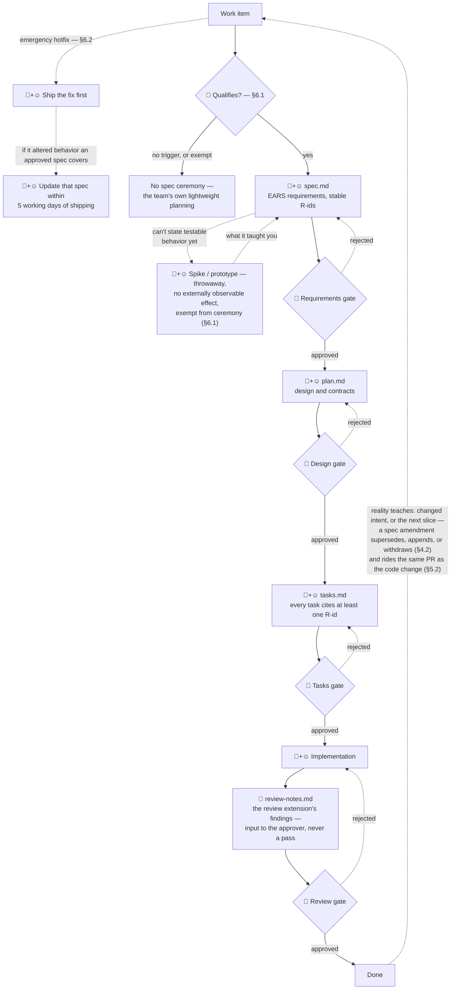

# sdd-standard

A spec-driven development (SDD) convention for an engineering
organization — versioned, reviewed, and distributed from this repository.

The convention itself is the product here. It is treated like a shared
library: semantic versioning on the convention, a changelog, code owners, and
changes by PR review. Product repos consume it via a bootstrap wrapper; specs
always live in each product repo next to the code they govern — there is
deliberately no central specs repository.

[GitHub Spec Kit](https://github.com/github/spec-kit) is the implementation
of the standard. The approved version is pinned in `speckit/PINNED-VERSION`;
upgrades are tested in this repo first.

## Why not stock Spec Kit?

Stock Spec Kit is a workflow tool: it walks an AI agent from spec through
plan and tasks to implementation. Nothing in it says who approves an
artifact, how requirement ids stay stable over time, or what happens when
code drifts from an approved spec. The convention layers those rules on top —
through Spec Kit's supported preset and extension mechanisms, no forks —
and keeps the tool replaceable. What it adds
([SDD-STANDARD](standard/SDD-STANDARD.md), § references below):

- **Human gates.** Artifacts pass Requirements → Design → Tasks gates
  before implementation and a Review gate after. Only a human approver
  passes a gate, by adding the `Status: APPROVED` line in their own
  change — agents never write Status lines, and the Review approver is
  never the implementer (§3).
- **Requirements that stay put.** Every requirement is one testable EARS
  behavior with a stable R-id — never renumbered, never reused; withdrawn
  ones stay listed. Acceptance criteria live in the spec alone; tracker
  items carry a summary and a link (§4).
- **Traceability with teeth.** Every task carries at least one `[R-n]`
  reference, and a change that alters spec-covered behavior updates that
  spec in the same PR. `ci/check_spec_structure.py` enforces the
  structure as merge-blocking CI — an artifact that outruns its approvals
  (a plan without an APPROVED spec, tasks without an APPROVED plan, a
  missing Status line) turns the pipeline red (§5, §8).
- **One dialect, not one per team.** Repos adopt only via
  `bootstrap/init.py` at the pinned, tri-OS-tested version: shared
  constitution seeded (repos append principles, never weaken them), stack
  profile appended, no hand-copied templates quietly diverging (§2.4, §7,
  §9).
- **A review phase.** After implementation, the review
  extension (`speckit.sdd.review`) compares what was built against
  the approved artifacts and writes notes for the human Review approver —
  input to the Review gate (§3), never a pass of it.
- **A pressure valve.** A work item matching none of the qualifying
  triggers (no contract or observable-behavior change, no boundary
  crossed, nothing hard to reverse, no new capability) needs no spec
  ceremony, and emergency hotfixes ship first and update the spec after —
  the ceremony binds where it pays, not everywhere (§6).

## The lifecycle in a product repo

How the rules above compose, end to end, in an adopting repo. The
normative text is [SDD-STANDARD](standard/SDD-STANDARD.md); this section
is the map.

Every work item starts at the qualification decision (§6.1): the gated
workflow binds when a change creates or alters externally observable
behavior or a contract (API, CLI, schema, message, protocol), crosses a
repo, service, or team boundary, contains a hard-to-reverse step, or
introduces a new capability — properties of the change itself, so no
estimation practice is required. Explicitly exempt, even where a trigger
appears to match: bugfixes restoring already-specified behavior,
refactorings and strict internal improvements, and changes with no
externally observable effect. An emergency hotfix ships first; when it
alters behavior an approved spec covers, that spec is updated within
5 working days of the fix shipping (§6.2).

A qualifying item's artifacts pass their gates in order — Requirements →
Design → Tasks before implementation starts, Review after it completes,
before the item is marked done (§3.1). Who does what: 🤖 the agent,
☺️ humans, 🤨 a human making the call, 🤖+☺️ both — typically the
agent drafts and a human shapes and owns it, though the convention
itself never requires an agent (§1, §9.1). Every gate is 🤨 alone by
design (§3.2), and the qualification call too is a human judgment
(§6.1). Solid edges are the gated pass; dashed edges are what makes this
a loop rather than a waterfall — the hotfix bypass, gate rejections, the
spike for what cannot yet be stated as testable behavior, and Done
feeding what was learned back into the next work item:

Each artifact gate passes the same way: a human approver adds
`Status: APPROVED — <name>, <date>` to that artifact in their own
change — agents never write or modify approval Status lines (§3.2). The
Review gate is passed the same human-only way by its approver, informed
by the review notes (§3.1, §3.3). A rejected artifact is revised and
resubmitted (§3.4). The artifacts live together in the product repo at
`specs/<NNN>-<kebab-slug>/` (§2.2), and each adopting team binds the
approver roles to named people at adoption:

| Gate | Approves | Approver role (§3.3) |
| ---- | -------- | -------------------- |
| Requirements | `spec.md` | The repo's product authority |
| Design | `plan.md` | The repo's technical authority |
| Tasks | `tasks.md` | The technical authority — may be the Design approver |
| Review | The implementation, against the approved artifacts | A reviewer who is **not** the implementer |

Underneath every lane run the two enforcement rules from the list
above: the same-PR spec-update rule — a merged violation is a
spec-drift incident (§5.2) — and the merge-blocking structure check
(§8.1), which turns the pipeline red on a `plan.md` drafted while
`spec.md` is still `DRAFT`, before a human has to catch it. A worked
walkthrough of one feature through all four gates is
[docs/quickstart.md](docs/quickstart.md); working the dashed edges —
evolving requirements, spikes, amendments — is
[docs/evolving-requirements.md](docs/evolving-requirements.md).

## Status

**Pre-1.0 (0.2.0-draft), complete and usable.** This repository is the standard
and its tooling — nothing else. It is being validated on demo projects;
adoption of the convention by real teams is a separate, later decision with
its own approval. Settled decisions are indexed with stable D-ids in
[DECISIONS.md](DECISIONS.md).

**Standard owner:** the maintainer(s) of this repository — a role, never a
person, defined in
[SDD-STANDARD §13](standard/SDD-STANDARD.md#13-ownership-and-versioning-of-this-standard).
An organization adopting the standard designates its own standard owner at
adoption. v1.0 is declared by the standard owner when real usage has earned
it.

## Layout

| Path         | Purpose                                                        |
| ------------ | -------------------------------------------------------------- |
| `standard/`  | The normative documents: SDD-STANDARD.md, stack profiles, glossary |
| `speckit/`   | Version pin, the standard's preset, extensions (the implementation layer) |
| `bootstrap/` | `init.py` — how a product repo adopts the convention (run via `uv run`) |
| `ci/`        | Structure and version checks — same scripts locally and on CI  |
| `docs/`      | Informative guides only — they explain, never legislate        |
| `examples/`  | Complete exemplary spec — the teaching example |

## Per-OS setup notes

The single scaffold script variant is **bash (`sh`)** on all three OS —
decided from the tri-OS matrix evidence, recorded in
[SDD-STANDARD §10](standard/SDD-STANDARD.md#10-scaffold-script-variant--binding-record).
Every OS needs [uv](https://docs.astral.sh/uv/) and git; Spec Kit itself is
installed pinned by `bootstrap/init.py` — never install it by hand.

- **Windows**: Git Bash ships with Git for Windows — no extra shell needed.
  One pitfall: the scaffold scripts need a **working** `python3` or `jq` in
  Git Bash, and stock Windows only has the Microsoft-Store `python3` stub,
  which breaks them silently
  ([spec-kit#3304](https://github.com/github/spec-kit/issues/3304)). Fix
  once per machine: `uv python install --default` (or install jq, or disable
  the `python3` App Execution Alias and put a real Python on PATH).
  Bootstrap's preflight checks this and tells you exactly what to run.
- **macOS**: nothing extra — the scripts run on the system bash 3.2
  (verified on the matrix's macOS runners).
- **Linux**: nothing extra.

## Hosting note

Where the hosting plan cannot enforce merge gates (branch protection and
rulesets are unavailable on free-plan private GitHub repos; CODEOWNERS
approval is a GitLab Premium feature), the checks still run and a red
pipeline is a merge-blocker by convention — recorded honestly, per
SDD-STANDARD §8.1. Self-hosted GitLab CE can run product-repo spec gates
with a single Linux runner — registerable by a project Maintainer, no
instance admin needed. Setup notes live in `docs/adopting-a-repo.md`.
