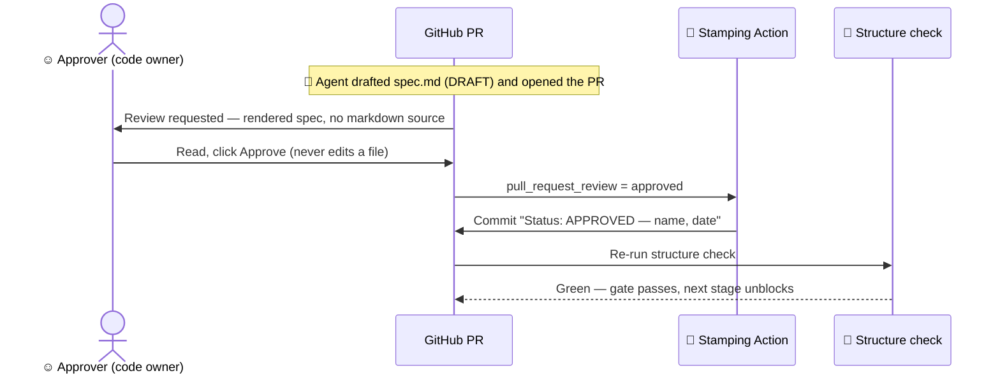
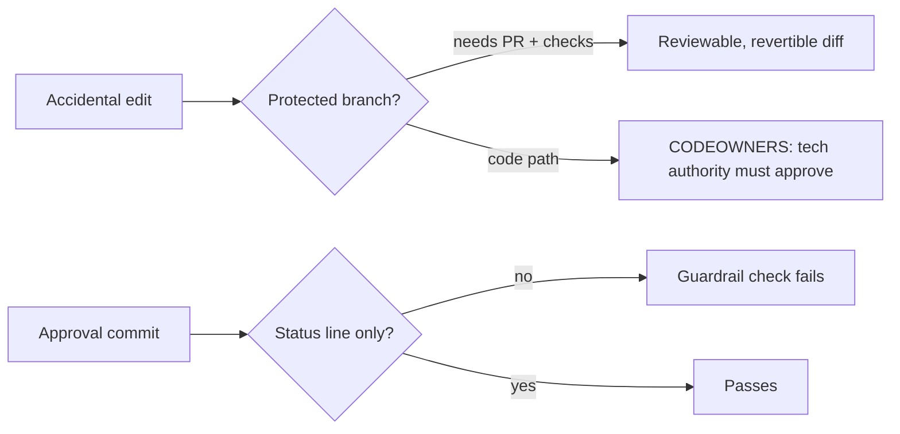

# Approving by review (GitHub factory)

**Informative.** How a code owner approves a gate by clicking **Approve** on
a pull request — never editing a file. Binding rules live in
[SDD-STANDARD.md](../standard/SDD-STANDARD.md) §3; in any conflict the
standard wins. This flow presumes the (pending) decision that lets a trusted
Action record the Status line on an authenticated approval — until it lands,
approve with your own commit ([reviewing-specs.md](reviewing-specs.md)).

## Setup (once per repo)

- **CODEOWNERS** maps each gate's paths (`specs/**`) to the role-bound
  approver; code files are owned by the technical authority.
- A **ruleset** on the default branch: require the code owner's review,
  block agent self-merge, require the structure check.
- A **stamping Action** (`on: pull_request_review`): on an approving review
  from the authorized code owner, it writes the `Status: APPROVED` line.
- A **guardrail check**: an approval commit may change nothing but that one
  Status line.

## The flow

## Your three steps, as approver

1. Open the link. **2.** Read the rendered document. **3.** Click **Approve**
(or comment to reject). You never open an editor.

## Why a stray edit can't hurt

- Approving is a review, not an edit — no files in reach during approval.
- The default branch is protected: nothing merges without the required
  review and checks.
- CODEOWNERS covers code too, so a non-code approver can't land code.
- Every change is a visible, attributed, revertible diff — accidents are
  caught, never silent.
