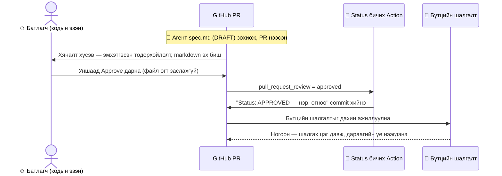
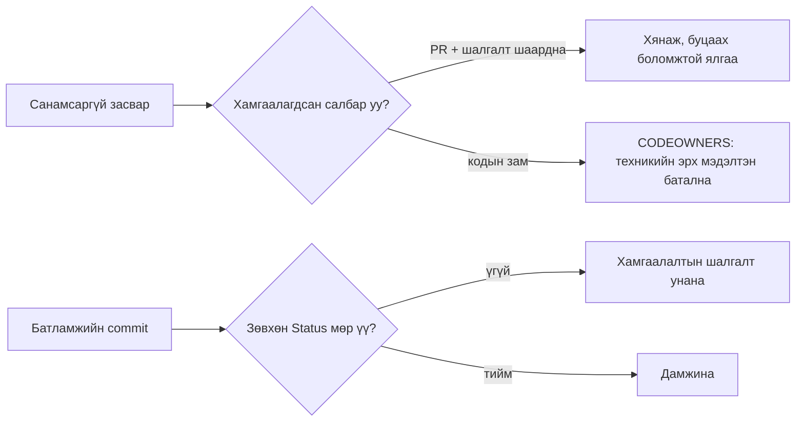

# Хянан батлах (GitHub үйлдвэр)

**Мэдээллийн зорилготой.** Кодын эзэн шалгах цэгийг (гейт) хэрхэн зөвхөн
pull request дээр **Approve** товч дарж баталдаг тухай — файл огт заслахгүйгээр.
Заавал мөрдөх дүрэм [SDD-STANDARD.md](../standard/SDD-STANDARD.md) §3-т байгаа;
зөрчилдвөл стандарт давуу. Энэ урсгал нь итгэмжлэгдсэн Action-д баталгаажсан
батламжийн үндсэн дээр Status мөрийг бичихийг зөвшөөрөх (хараахан батлагдаагүй)
шийдвэрийг таамаглаж байгаа — тэр болтол өөрийн commit-оор батлаарай
([reviewing-specs.md](reviewing-specs.md)).

## Тохиргоо (репо тутамд нэг удаа)

- **CODEOWNERS** нь шалгах цэг бүрийн зам (`specs/**`)-ыг тухайн үүрэгт
  томилогдсон батлагчид холбоно; кодын файлыг техникийн эрх мэдэлтэн эзэмшинэ.
- Үндсэн салбар дээрх **ruleset (дүрмийн багц)**: кодын эзний хяналтыг
  шаардах, агентыг өөрөө нэгтгэхийг хориглох, бүтцийн шалгалтыг шаардах.
- **Status бичих Action** (`on: pull_request_review`): эрх бүхий кодын эзэн
  батлахад `Status: APPROVED` мөрийг бичнэ.
- **Хамгаалалтын шалгалт**: батламжийн commit нь тэрхүү нэг Status мөрөөс
  өөр юуг ч өөрчилж болохгүй.

## Урсгал

## Батлагчийн хувьд гурван алхам

1. Холбоосыг нээ. **2.** Эмхэтгэсэн баримтыг унш. **3.** **Approve** дар
(эсвэл татгалзвал сэтгэгдэл бич). Та засварлагч огт нээхгүй.

## Санамсаргүй засвар яагаад хор хөнөөл учруулж чадахгүй вэ

- Батлах гэдэг нь хяналт, засвар биш — батлах үед файл гарт орохгүй.
- Үндсэн салбар хамгаалагдсан: шаардлагатай хяналт, шалгалтгүйгээр юу ч
  нэгдэхгүй.
- CODEOWNERS кодыг ч хамардаг тул кодын бус батлагч код нэгтгэж чадахгүй.
- Өөрчлөлт бүр харагдах, эзэнтэй, буцаах боломжтой ялгаа — алдаа нуугдахгүй,
  баригдана.
